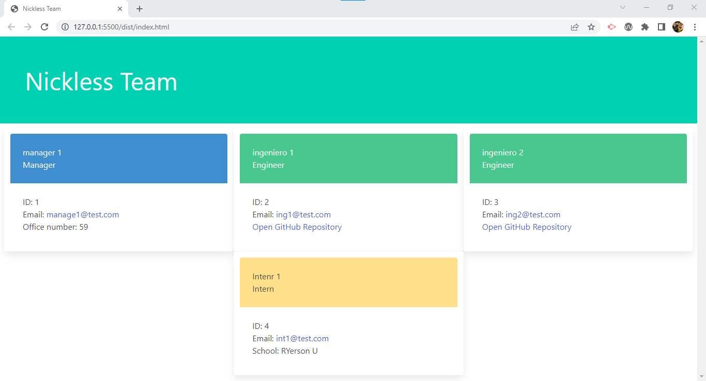

# Nickless Team


## Description

This application allows the user to generate a web page containing information from their team. Such information includes role, email address, Github account (for Engineers), university (for Interns) and office number (for Managers).


## Installation

In order to use this project, make sure to sure 'npm install' to obtain the appropriate npm modules that allow for the execution of the application. Please also make sure to read this entire README.md file for all additional information.

## Usage

To start the execution of the application, type 'node index' or 'node index.js' and the series of prompts will guide you through the process of data collection. Once the last user information has been collected and the user has indicated that no more team members will be added, then "index.html" is generated at the /dist/directory.



A quick demo was recorded and can be found on the link below:

https://drive.google.com/file/d/1057t6pxEzUCulsyHT6sNRGrx3gsW3wSD/view

## Contribute

To contribute to this project, please fork it from the GitHub repository and when the pull request is sent, our team will work on merging the changes as needed/appropriate.

GitHub Repository Link: https://github.com/nickless192/nickless-team

## Testing

Unit testing has been set up with the use of Jest. To test, type in:

```
npm run test
```

Tests have been set up for the Employee, Manager, Engineer and Intern classes.

## License

This project is covered under the MIT license agreement.

## Questions

Find my GitHub profile at https://github.com/nickless192 or email me at nickless@nickless.com.

